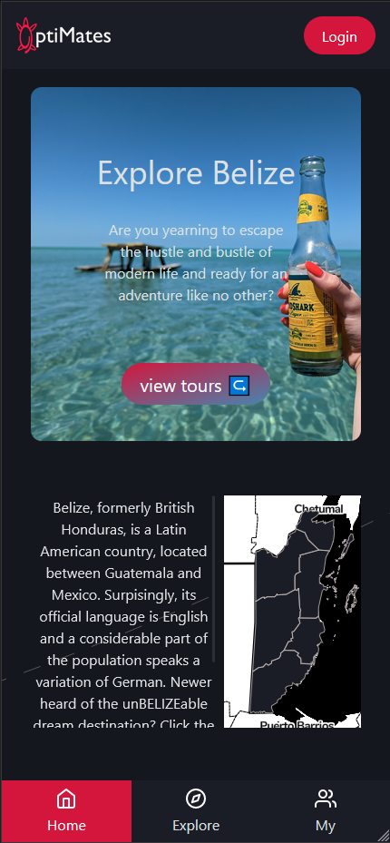
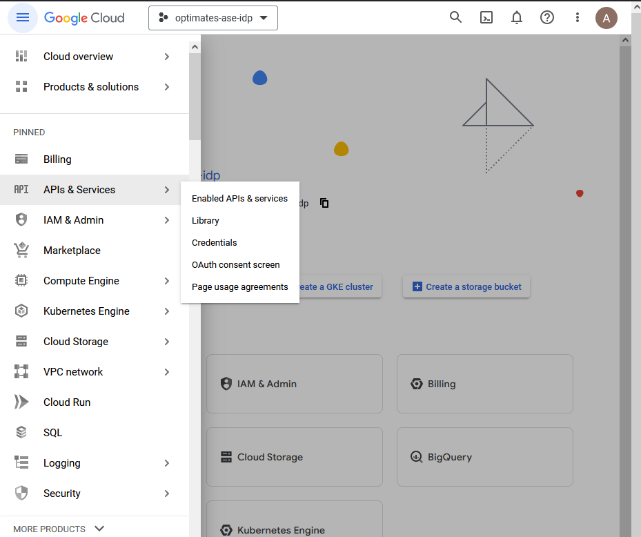
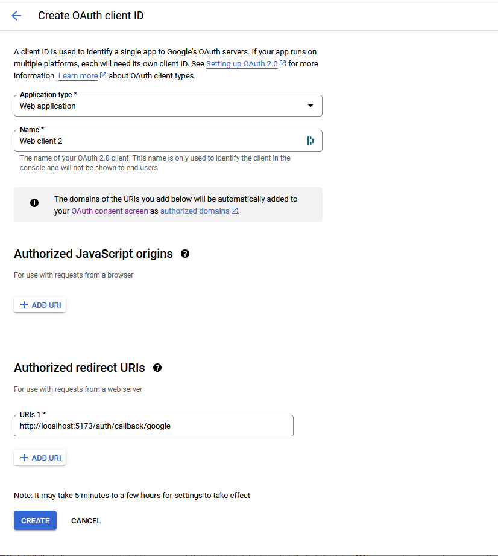
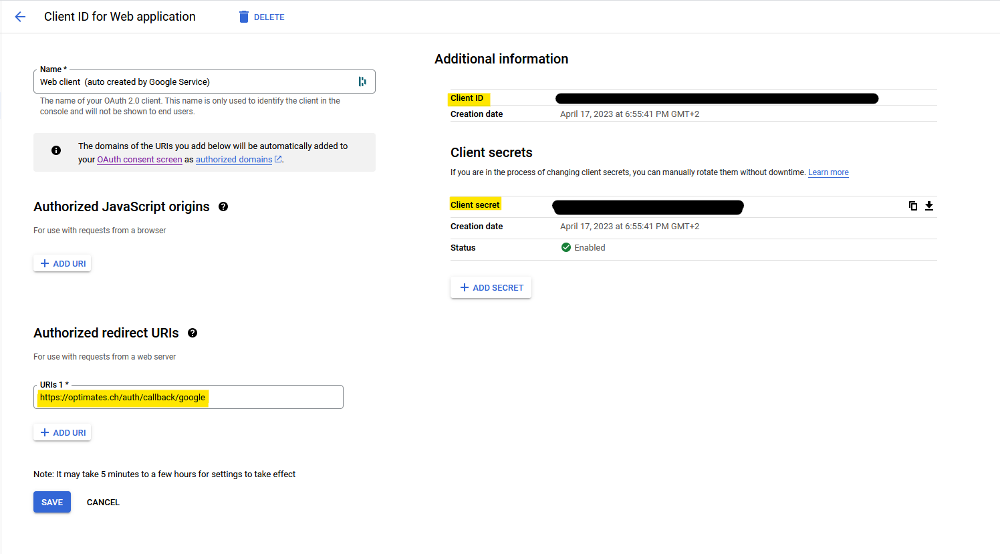
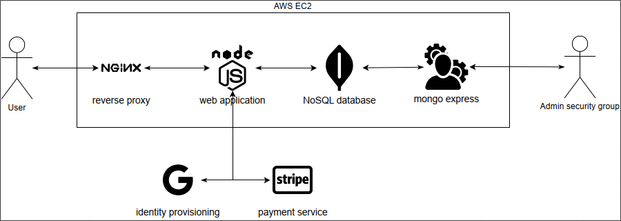

# Advanced Software Engineering (03SM22MI0026)

By pure chance, two of the five group members have visited the astonishing country Belize within the last 12 months.
Its economy is heavily dependent on the tourism, which took a hard hit the last couple of years due to the COVID related travel restrictions.
Toursim has slowly picked up but according to the locals that we encountered during our holidays, it is nowhere near pre-pandemic levels.
To spread the word about the astonishing and small country Belize, our group created an e-commerce plattform with the ultimate aim of sending some business to the country.

Our website consists of three main pages:

- Homepage
- Explore Page
- Profile Page

These pages aim to spark interest in the country, highlight the adventures that await tourists and ultimately connect them to qualified tour guides in Belize. We have structured the website and modelled the required data in a way that adding a new hidden vacation gem, basically only requires adding new documents to our `mongodb` database collections.

## Contributors:

- Alberto Masera, 22-738-116
- Andy Aidoo, 17-700-451
- Filip Dombos, 14-939-664

## Disclaimer:

Our initial vision and the final project do differ, substantially.
This is mainly due to unequal project involvevemnt that started while developing the project envisioning; one half of the team was highly motivated while the other half goofed of and continued to dodge taking responsibility.
We were determined to success as a group. Retrospectively, we should have
This ultimately led to only three of the five team members contributing to this project.

## Product Demo:

You can find a running [Production Version](https://optimates.ch). It's filled with mock data and shows what a live version could look like.

_(Website looks best on mobile)_

## Features:

Generally speaking, our application offers four overarching features:

- Country Exploration
- Identity and Access Management (IAM)
- Payment Method (Stripe)
- Contact Brokerage

IAM and Payment Method require some setup work with the Google Cloud Console and Stripe, respectively.

### Country Exploration

To get an overview of the country, we have compiled a plethora of information about Belize.
Website visitors are first greeted by the view that waits for them on _Secret Beach, San Pedro_.
To convey the geographic orientation of the still largely unkown (at least in Europe) Carribean paradise, we have added an interactive map that we've beefed up with geoJSONs to add more layers.
Curious users who click one of the marked districts discover the district's name alongside cultural and geographic highlights.

Scrolling down reveals an equirectangular (360°-sphere) photo of one of the many secluded beaches that can be found on the island San Pedro in Belize.
Followed by a short video where one can have a teaser of the island life.
Ultimately, we have discribed each district in more detail and compiled a list of attractions that are highly recommendable.

### IAM

Assuming that visitors will want to book tours and get into contact with their future guides, we need to be able authenticate users.
To simplfify user signup and minimize the drop off percentage when users create their profile, we opted for a social login strategy early on.
Initially, we wanted to host our own Identity and Access Management solution with [Keycloak](https://github.com/keycloak/keycloak).
In the course of the development process, we realized that we really only required a tiny part of their functionalities and the library [authjs](https://authjs.dev/) covers all of our needs.
For our svelte-application to work with authjs, several configuration steps need to be made before running the application:

1. go to [google cloud console](https://console.cloud.google.com/) and create a new project.
2. Navigation > APIs & Services > Credentials > `+ CREATE CREDENTIALS` > `OAUTH client ID` 
3. Select `Web application` as Application type and add Authorized redirect URIs
4. Note down Client ID and Client secret and add it to .env file
5. create AUTH_SECRET using the command`openssl rand -base64 32` and add it to .env

This secure login flow allows us to identify our users based on their Google accounts and makes us immune from password leaks, as we do no use any!

Now you should be able to run the application with:

`npm run build && npm run dev`

and use your Google account to signup and login with our application (once you have started the mongodb docker service).

### Payment Method

After researching an easy and secure payment method, we ultimately decided to leverage the leading payment processing platform _stripe_ and utilized their `javascript`-client `Stripe.js`.
While `Stripe Checkout` requires the least configuration, the more involved setup of their client offers more flexibility, i.e. it allows us to generate shopping carts dynamically and then leverage their billing capabilities.
As a consequence, we do not store any highly sensitive credit card information of our users.

To communicate with Stripe a publishable key and a secret are required. Both of which are provided by Stripe once an instance has been created on their services. Due to high safety concerns regarding payment confidentiality and fraud aversion, the integration in our sveltekit-application happens both on server and client side. The client collects all the required information and proceeds to post a request to our native backend, which in turn connects to Stripe API to create a "Payment Intent". Having successfully received this instance, we can return it to our client for safe payment. The amount specified earlier can now be collected with a credit card. Please note that our Stripe instance currently operates on test mode. To test our Payment implementation please use the following credit card:
`4242 4242 4242 4242`. The expiration date has to be in the future, but the remaining inputs (CVC and ZIP) can be arbitrarily chosen.

Provided you have followed the previous steps precisely and after runnning the commands:

`npm run build && npm run dev`

you should now be able to add tours to your basket and even perform a mock checkout.

### Contact Brokerage

**TODO explain the motivation for socket.io**

### docker-compose

It is possible to start our app with the `./build-and-deploy.sh` on Linux/macOs and `build-and-deploy.bat` on Windows with one minor modifications. Change line 3 in src/db/mongodb.ts as follows:

- const client = new MongoClient("mongodb://**0.0.0.0**:27017/optimates");
- const client = new MongoClient("mongodb://**mongodb**:27017/optimates");

When you serve the application with `npm run dev`, it does not run in a docker container, outside traffic needs to target 0.0.0.0. When the application is built and deployed in docker container, you'll either need to find out mongodb's ip address or just use its container name.

## Application Architecture

We have used an AWS EC2 instance to spin up a docker container with four services that are all part of a bridge network:

- MongoDB
- Mongo-Express
- Sveltekit-App
- NGINX-reverse-proxy

### MongoDB

Our MongoDB service runs on the default port `27017` and we have mounted volumes to persist the data between container restarts.

### Mongo-Express

We have used this service to populate our database with the data required to display the map, country and district information.
To access the GUI, we have created a security group to allow inbound traffic to port 8081 where we serve Mongo-Express.

### Sveltekit-Application

This service is running on port `3000` in our bridge network after it is built with the dockerfile.
Sveltekit was chosen because we could leverage its SSR capabilities while reducing the restrain and loadtimes on the client, allowing for a more fluid experience, while emerging in the touristic wonders of Belize.

### NGINX Reverse Proxy

To serve our node application via https, we set up a nginx reverse proxy with the correct ssl-certificates that we received from Switzerland biggest webhosting company.

## Project Organisation

As aformentioned in [Disclaimer](#disclaimer), our project organisation definitely could and should have been more disciplined.
Initially, we set up a `trello` board that we hardly ever used.
Progress in the frontend happended steadily and we assumed that it was the same case for the backend.
During the third sprint, we realized that more alignment was needed between front- and backend and we would maintain our trello boards more dutifully.
Unfortunately, neither quality of the backend nor the effort improved.
At that time, we stored all necessary data as JSONs in the frontend and expected to seamlessly migrate to calling the backend microservice.
Unfortunately, this did not work as expected:

- post requests to the backend failed, because fields that were optional in the frontend were mandatory in the backend
- get requests for users were only possible with the id that was created on the backend. During a login, we had no way of getting the correct id for a user (We only received the ids once when a user signed up).
- once searching for a user via email was possible, we realized that elastic search does not look for exact matches (unusable since we use emails as unique ids)
  This led us to the decision to discard the whole backend, replace the database with mongodb and continue the work as a group of three.
